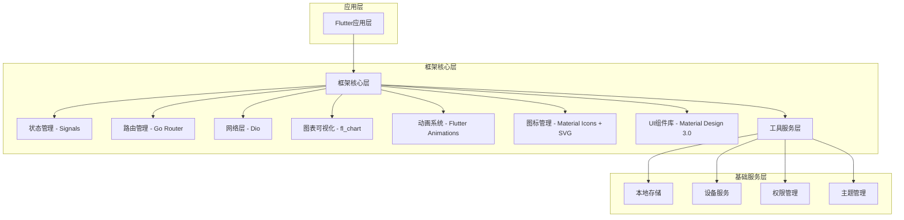
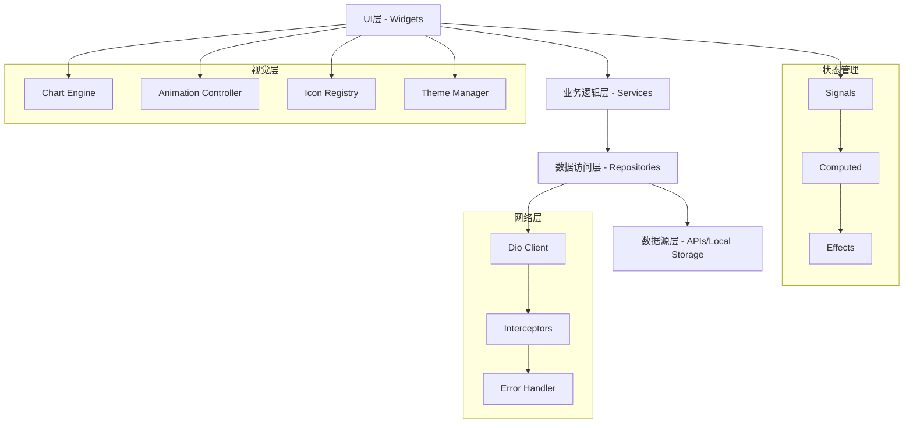
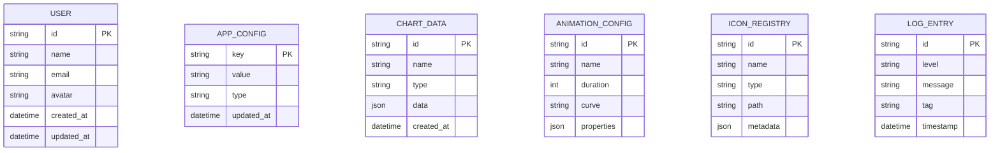

# Flutter快速开发框架技术架构文档

## 1. 架构设计



## 2. 技术描述

- **前端框架**：Flutter@3.16+ + Dart@3.2+
- **状态管理**：signals@5.0+ (轻量级响应式状态管理)
- **路由管理**：go_router@12.0+ (声明式路由，支持页面转场动画)
- **网络请求**：dio@5.3+ (HTTP客户端)
- **图表可视化**：fl_chart@0.65+ (高性能图表库)
- **动画系统**：Flutter内置动画 + rive@0.12+ (复杂动画)
- **图标管理**：flutter_svg@2.0+ + material_design_icons_flutter@7.0+
- **UI组件库**：flutter/material + flutter/cupertino + 自定义组件
- **本地存储**：shared_preferences@2.2+ (简单键值存储)
- **工具库**： flutter_screenutil@5.9+ (屏幕适配)

## 3. 路由定义

| 路由 | 用途 |
|------|------|
| / | 应用首页，展示主要功能入口 |
| /home | 主页面，包含导航和内容区域 |
| /charts | 图表展示页面，数据可视化演示 |
| /animations | 动画演示页面，各种动画效果展示 |
| /icons | 图标库页面，图标管理和预览 |
| /components | UI组件库页面，组件展示和文档 |
| /profile | 用户资料页面，显示和编辑用户信息 |
| /settings | 设置页面，应用配置和偏好设置 |
| /demo | 演示页面，展示框架功能和组件 |

## 4. API定义

### 4.1 核心API

**状态管理相关**

```dart
// 创建信号
final counter = signal(0);

// 计算属性
final doubleCounter = computed(() => counter.value * 2);

// 副作用
effect(() => print('Counter: ${counter.value}'));

// 图表数据状态
final chartData = signal<List<ChartData>>([]);
final selectedChart = signal<ChartType>(ChartType.line);
```

**网络请求封装**

```dart
class ApiService {
  static final dio = Dio();
  
  static Future<T> get<T>(String path) async {
    final response = await dio.get(path);
    return response.data;
  }
  
  static Future<T> post<T>(String path, dynamic data) async {
    final response = await dio.post(path, data: data);
    return response.data;
  }
  
  // 获取图表数据
  static Future<List<ChartData>> getChartData(String endpoint) async {
    final response = await dio.get('/api/charts/$endpoint');
    return (response.data as List)
        .map((item) => ChartData.fromJson(item))
        .toList();
  }
}
```

**路由配置**

```dart
final router = GoRouter(
  routes: [
    GoRoute(
      path: '/',
      builder: (context, state) => const HomePage(),
      pageBuilder: (context, state) => CustomTransitionPage(
        child: const HomePage(),
        transitionsBuilder: (context, animation, secondaryAnimation, child) {
          return SlideTransition(
            position: animation.drive(
              Tween(begin: const Offset(1.0, 0.0), end: Offset.zero),
            ),
            child: child,
          );
        },
      ),
    ),
    GoRoute(
      path: '/charts',
      builder: (context, state) => const ChartsPage(),
    ),
    GoRoute(
      path: '/animations',
      builder: (context, state) => const AnimationsPage(),
    ),
  ],
);
```

**图表组件API**

```dart
class ChartWidget extends StatelessWidget {
  final List<ChartData> data;
  final ChartType type;
  final bool animate;
  final Duration animationDuration;
  
  const ChartWidget({
    required this.data,
    required this.type,
    this.animate = true,
    this.animationDuration = const Duration(milliseconds: 300),
  });
  
  @override
  Widget build(BuildContext context) {
    switch (type) {
      case ChartType.line:
        return LineChart(/* ... */);
      case ChartType.bar:
        return BarChart(/* ... */);
      case ChartType.pie:
        return PieChart(/* ... */);
    }
  }
}
```

**动画管理API**

```dart
class AnimationManager {
  static const Duration defaultDuration = Duration(milliseconds: 300);
  static const Curve defaultCurve = Curves.easeInOut;
  
  // 页面转场动画
  static Widget slideTransition(Widget child, Animation<double> animation) {
    return SlideTransition(
      position: Tween<Offset>(
        begin: const Offset(1.0, 0.0),
        end: Offset.zero,
      ).animate(CurvedAnimation(
        parent: animation,
        curve: defaultCurve,
      )),
      child: child,
    );
  }
  
  // 淡入淡出动画
  static Widget fadeTransition(Widget child, Animation<double> animation) {
    return FadeTransition(
      opacity: animation,
      child: child,
    );
  }
}
```

**图标管理API**

```dart
class IconManager {
  // 获取Material图标
  static IconData getMaterialIcon(String name) {
    return Icons.values.firstWhere(
      (icon) => icon.toString().contains(name),
      orElse: () => Icons.help,
    );
  }
  
  // 获取SVG图标
  static Widget getSvgIcon(String assetPath, {double? size, Color? color}) {
    return SvgPicture.asset(
      assetPath,
      width: size,
      height: size,
      colorFilter: color != null 
          ? ColorFilter.mode(color, BlendMode.srcIn)
          : null,
    );
  }
  
  // 图标缓存
  static final Map<String, Widget> _iconCache = {};
  
  static Widget getCachedIcon(String key, Widget Function() builder) {
    return _iconCache.putIfAbsent(key, builder);
  }
}
```

## 5. 服务架构图



## 6. 数据模型

### 6.1 数据模型定义



### 6.2 数据定义语言

**用户模型 (User)**

```dart
class User {
  final String id;
  final String name;
  final String email;
  final String? avatar;
  final DateTime createdAt;
  final DateTime updatedAt;
  
  User({
    required this.id,
    required this.name,
    required this.email,
    this.avatar,
    required this.createdAt,
    required this.updatedAt,
  });
  
  factory User.fromJson(Map<String, dynamic> json) => User(
    id: json['id'],
    name: json['name'],
    email: json['email'],
    avatar: json['avatar'],
    createdAt: DateTime.parse(json['created_at']),
    updatedAt: DateTime.parse(json['updated_at']),
  );
}
```

**图表数据模型 (ChartData)**

```dart
enum ChartType { line, bar, pie, scatter, radar }

class ChartData {
  final String id;
  final String name;
  final ChartType type;
  final List<DataPoint> data;
  final DateTime createdAt;
  
  ChartData({
    required this.id,
    required this.name,
    required this.type,
    required this.data,
    required this.createdAt,
  });
}

class DataPoint {
  final double x;
  final double y;
  final String? label;
  final Color? color;
  
  DataPoint({
    required this.x,
    required this.y,
    this.label,
    this.color,
  });
}
```

**动画配置模型 (AnimationConfig)**

```dart
class AnimationConfig {
  final String id;
  final String name;
  final Duration duration;
  final Curve curve;
  final Map<String, dynamic> properties;
  
  AnimationConfig({
    required this.id,
    required this.name,
    required this.duration,
    required this.curve,
    required this.properties,
  });
}
```

**图标注册模型 (IconRegistry)**

```dart
enum IconType { material, svg, font }

class IconInfo {
  final String id;
  final String name;
  final IconType type;
  final String path;
  final Map<String, dynamic> metadata;
  
  IconInfo({
    required this.id,
    required this.name,
    required this.type,
    required this.path,
    required this.metadata,
  });
}
```

**本地存储服务**

```dart
class StorageService {
  static late SharedPreferences _prefs;
  
  static Future<void> init() async {
    _prefs = await SharedPreferences.getInstance();
  }
  
  // 基础存储方法
  static Future<bool> setString(String key, String value) {
    return _prefs.setString(key, value);
  }
  
  static String? getString(String key) {
    return _prefs.getString(key);
  }
  
  // 主题配置存储
  static Future<bool> setThemeMode(ThemeMode mode) {
    return _prefs.setString('theme_mode', mode.name);
  }
  
  static ThemeMode getThemeMode() {
    final mode = _prefs.getString('theme_mode');
    return ThemeMode.values.firstWhere(
      (e) => e.name == mode,
      orElse: () => ThemeMode.system,
    );
  }
  
  // 图表配置存储
  static Future<bool> saveChartConfig(String chartId, Map<String, dynamic> config) {
    return _prefs.setString('chart_$chartId', jsonEncode(config));
  }
  
  static Map<String, dynamic>? getChartConfig(String chartId) {
    final config = _prefs.getString('chart_$chartId');
    return config != null ? jsonDecode(config) : null;
  }
}
```

**主题管理服务**

```dart
class ThemeService {
  static ThemeData lightTheme = ThemeData(
    useMaterial3: true,
    colorScheme: ColorScheme.fromSeed(
      seedColor: const Color(0xFF2196F3),
      brightness: Brightness.light,
    ),
    animationDuration: const Duration(milliseconds: 300),
  );
  
  static ThemeData darkTheme = ThemeData(
    useMaterial3: true,
    colorScheme: ColorScheme.fromSeed(
      seedColor: const Color(0xFF2196F3),
      brightness: Brightness.dark,
    ),
    animationDuration: const Duration(milliseconds: 300),
  );
  
  // 自定义图表主题
  static Map<String, Color> getChartColors(BuildContext context) {
    final colorScheme = Theme.of(context).colorScheme;
    return {
      'primary': colorScheme.primary,
      'secondary': colorScheme.secondary,
      'surface': colorScheme.surface,
      'onSurface': colorScheme.onSurface,
    };
  }
}
```