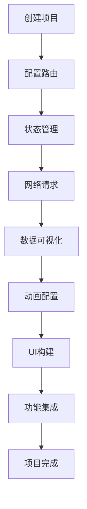

# Flutter快速开发框架产品需求文档

## 1. 产品概述

本项目旨在构建一个轻量级、高性能的Flutter快速开发框架，专注于简洁性和开发效率。
框架将集成现代Flutter最佳实践，提供开箱即用的解决方案，包含图表可视化、动画系统、图标管理、SVG支持和完整UI组件库。
目标是成为中小型Flutter项目的首选开发框架，显著提升开发效率和代码质量，提供丰富的视觉交互体验。

## 2. 核心功能

### 2.1 用户角色

| 角色 | 使用方式 | 核心权限 |
|------|----------|----------|
| Flutter开发者 | 直接集成框架 | 使用所有框架功能，自定义配置，访问组件库和工具 |
| UI设计师 | 设计系统集成 | 使用设计令牌，自定义主题，配置动画效果 |
| 项目负责人 | 项目架构决策 | 选择技术栈，制定开发规范，性能监控 |

### 2.2 功能模块

我们的Flutter快速开发框架包含以下核心模块：
1. **状态管理模块**：基于Signals的响应式状态管理，自动依赖跟踪
2. **路由导航模块**：声明式路由管理，支持嵌套路由和页面转场动画
3. **网络请求模块**：统一的HTTP客户端，支持拦截器和错误处理
4. **图表可视化模块**：基于fl_chart的数据可视化，支持多种图表类型
5. **动画系统模块**：页面转场、组件动画、加载动画的统一管理
6. **图标管理模块**：矢量图标、字体图标、SVG图标的统一管理系统
7. **UI组件库模块**：基于Material Design 3.0的完整组件库
8. **工具类模块**：常用工具函数，本地存储等
9. **项目模板模块**：标准化的项目结构和配置文件

### 2.3 页面详情

| 页面名称 | 模块名称 | 功能描述 |
|----------|----------|----------|
| 框架初始化 | 项目模板 | 创建标准项目结构，配置依赖包，设置基础配置文件 |
| 状态管理 | Signals集成 | 提供signal、computed、effect等API，自动依赖跟踪和UI更新 |
| 路由管理 | Go Router集成 | 声明式路由配置，支持路径参数、查询参数、页面转场动画 |
| 网络请求 | Dio封装 | 统一请求接口，自动错误处理，请求/响应拦截器配置 |
| 图表展示 | 数据可视化 | 线图、柱状图、饼图、散点图等，支持交互和动画效果 |
| 动画管理 | 动画系统 | 页面转场动画、组件动画、加载动画的配置和管理 |
| 图标系统 | 图标管理 | 内置图标、自定义图标、SVG图标的统一管理和使用 |
| UI组件库 | 组件展示 | 按钮、输入框、卡片、列表等组件，支持主题定制 |
| 工具服务 | 工具类 | 本地存储、设备信息、权限管理等工具 |

## 3. 核心流程

**开发者使用流程：**
1. 使用框架模板创建新项目
2. 配置路由和页面转场动画
3. 使用Signals管理应用状态
4. 集成网络请求和数据处理
5. 使用图表组件进行数据可视化
6. 配置动画效果和图标系统
7. 使用UI组件库快速构建界面
8. 利用工具类处理通用功能

## 4. 用户界面设计

### 4.1 设计风格

- **主色调**：#2196F3（蓝色）、#4CAF50（绿色）
- **辅助色**：#FF9800（橙色）、#F44336（红色）、#9C27B0（紫色）
- **按钮风格**：圆角矩形，Material Design 3.0风格，支持涟漪动画
- **字体**：Roboto（Android）、SF Pro（iOS），主要字号14sp-18sp
- **布局风格**：卡片式布局，顶部导航栏，底部标签栏，支持响应式设计
- **图标风格**：Material Icons + 自定义SVG图标，简洁线性风格
- **动画风格**：流畅的缓动曲线，适中的动画时长（200-300ms）

### 4.2 页面设计概览

| 页面名称 | 模块名称 | UI元素 |
|----------|----------|--------|
| 项目模板 | 脚手架工具 | 命令行界面，进度指示器，配置选项表单，动画反馈 |
| 状态管理 | Signals API | 代码示例展示，实时状态变化演示，API文档，交互动画 |
| 路由管理 | 导航组件 | 路由树状图，页面跳转动画预览，面包屑导航 |
| 网络请求 | 请求管理 | 加载指示器，错误提示组件，状态动画 |
| 图表展示 | 数据可视化 | 图表容器，图例组件，工具提示，交互动画，数据标签 |
| 动画管理 | 动画系统 | 动画预览区域，参数调节面板，时间轴控制，效果展示 |
| 图标系统 | 图标管理 | 图标网格展示，搜索过滤，分类标签，预览面板 |
| UI组件库 | 组件展示 | 组件预览卡片，属性配置面板，代码示例，主题切换 |
| 工具服务 | 功能模块 | 功能列表，使用示例，配置界面，状态指示器 |

### 4.3 响应式设计

框架采用移动优先的响应式设计，支持手机、平板和桌面端适配。
- **断点设置**：手机(<600dp)、平板(600-1200dp)、桌面(>1200dp)
- **交互优化**：触摸友好的按钮尺寸(最小44dp)，手势支持
- **动画适配**：根据设备性能自动调整动画复杂度和帧率
- **图表适配**：响应式图表尺寸，触摸交互优化，数据标签自适应