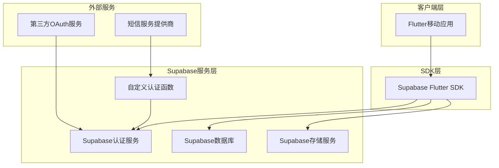
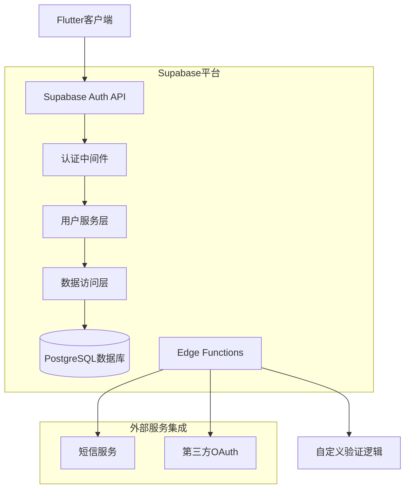
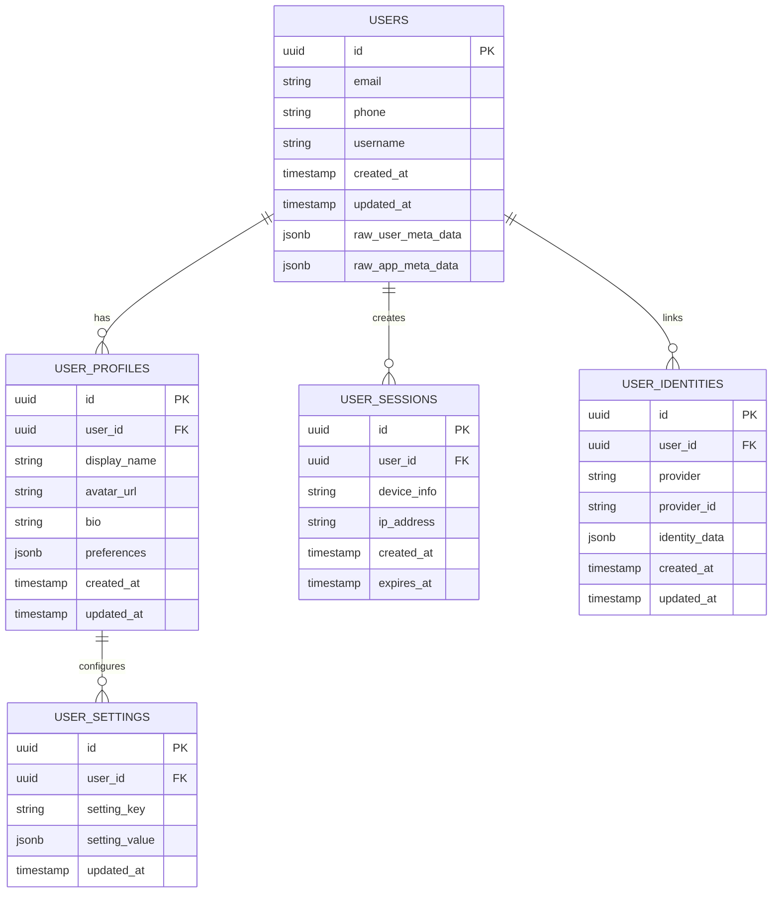

# Supabase多元化认证系统技术架构文档

## 1. 架构设计



## 2. 技术描述

- **前端**: Flutter@3.16.0 + supabase_flutter@2.0.0 + go_router@12.0.0
- **后端**: Supabase (PostgreSQL + 认证服务 + Edge Functions)
- **状态管理**: signals@5.0.0
- **网络请求**: dio@5.3.0 (用于第三方API调用)
- **本地存储**: shared_preferences@2.2.0 + flutter_secure_storage@9.0.0

## 3. 路由定义

| 路由 | 用途 |
|------|------|
| /login | 登录页面，支持多种登录方式选择 |
| /register | 注册页面，支持手机号、用户名、第三方注册 |
| /home | 主页，登录后的默认页面 |
| /profile | 用户中心，个人信息和账户管理 |
| /settings | 设置页面，登录偏好和安全设置 |
| /auth/callback | OAuth回调页面，处理第三方登录返回 |
| /verify | 验证页面，处理手机号和邮箱验证 |

## 4. API定义

### 4.1 认证相关API

**手机号注册**
```
POST /auth/v1/signup
```

请求参数:
| 参数名 | 参数类型 | 是否必需 | 描述 |
|--------|----------|----------|------|
| phone | string | true | 手机号码 |
| password | string | true | 用户密码 |
| data | object | false | 额外用户信息 |

响应:
| 参数名 | 参数类型 | 描述 |
|--------|----------|------|
| user | object | 用户信息对象 |
| session | object | 会话信息 |

**用户名登录**
```
POST /auth/v1/token?grant_type=password
```

请求参数:
| 参数名 | 参数类型 | 是否必需 | 描述 |
|--------|----------|----------|------|
| username | string | true | 用户名 |
| password | string | true | 密码 |

**短信验证码发送**
```
POST /auth/v1/otp
```

请求参数:
| 参数名 | 参数类型 | 是否必需 | 描述 |
|--------|----------|----------|------|
| phone | string | true | 手机号码 |
| type | string | true | 验证类型(sms) |

**第三方OAuth登录**
```
POST /auth/v1/authorize
```

请求参数:
| 参数名 | 参数类型 | 是否必需 | 描述 |
|--------|----------|----------|------|
| provider | string | true | 提供商(google, apple, wechat) |
| redirect_to | string | false | 回调地址 |

### 4.2 用户管理API

**获取用户信息**
```
GET /auth/v1/user
```

**更新用户信息**
```
PUT /auth/v1/user
```

**绑定手机号**
```
PUT /auth/v1/user
```

请求参数:
| 参数名 | 参数类型 | 是否必需 | 描述 |
|--------|----------|----------|------|
| phone | string | true | 新手机号 |
| phone_confirm_token | string | true | 验证令牌 |

## 5. 服务器架构图



## 6. 数据模型

### 6.1 数据模型定义



### 6.2 数据定义语言

**用户扩展信息表 (user_profiles)**
```sql
-- 创建用户扩展信息表
CREATE TABLE user_profiles (
    id UUID PRIMARY KEY DEFAULT gen_random_uuid(),
    user_id UUID REFERENCES auth.users(id) ON DELETE CASCADE,
    display_name VARCHAR(100),
    avatar_url TEXT,
    bio TEXT,
    phone_verified BOOLEAN DEFAULT FALSE,
    email_verified BOOLEAN DEFAULT FALSE,
    preferences JSONB DEFAULT '{}',
    created_at TIMESTAMP WITH TIME ZONE DEFAULT NOW(),
    updated_at TIMESTAMP WITH TIME ZONE DEFAULT NOW()
);

-- 创建索引
CREATE UNIQUE INDEX idx_user_profiles_user_id ON user_profiles(user_id);
CREATE INDEX idx_user_profiles_display_name ON user_profiles(display_name);

-- 设置RLS策略
ALTER TABLE user_profiles ENABLE ROW LEVEL SECURITY;

-- 用户只能访问自己的资料
CREATE POLICY "Users can view own profile" ON user_profiles
    FOR SELECT USING (auth.uid() = user_id);

CREATE POLICY "Users can update own profile" ON user_profiles
    FOR UPDATE USING (auth.uid() = user_id);

CREATE POLICY "Users can insert own profile" ON user_profiles
    FOR INSERT WITH CHECK (auth.uid() = user_id);

-- 授权访问权限
GRANT SELECT ON user_profiles TO anon;
GRANT ALL PRIVILEGES ON user_profiles TO authenticated;
```

**用户设置表 (user_settings)**
```sql
-- 创建用户设置表
CREATE TABLE user_settings (
    id UUID PRIMARY KEY DEFAULT gen_random_uuid(),
    user_id UUID REFERENCES auth.users(id) ON DELETE CASCADE,
    setting_key VARCHAR(50) NOT NULL,
    setting_value JSONB NOT NULL DEFAULT '{}',
    created_at TIMESTAMP WITH TIME ZONE DEFAULT NOW(),
    updated_at TIMESTAMP WITH TIME ZONE DEFAULT NOW()
);

-- 创建唯一索引
CREATE UNIQUE INDEX idx_user_settings_user_key ON user_settings(user_id, setting_key);

-- 设置RLS策略
ALTER TABLE user_settings ENABLE ROW LEVEL SECURITY;

CREATE POLICY "Users can manage own settings" ON user_settings
    FOR ALL USING (auth.uid() = user_id);

-- 授权访问权限
GRANT ALL PRIVILEGES ON user_settings TO authenticated;
```

**登录会话记录表 (user_sessions)**
```sql
-- 创建登录会话记录表
CREATE TABLE user_sessions (
    id UUID PRIMARY KEY DEFAULT gen_random_uuid(),
    user_id UUID REFERENCES auth.users(id) ON DELETE CASCADE,
    device_info JSONB DEFAULT '{}',
    ip_address INET,
    login_method VARCHAR(20) DEFAULT 'password',
    created_at TIMESTAMP WITH TIME ZONE DEFAULT NOW(),
    expires_at TIMESTAMP WITH TIME ZONE,
    is_active BOOLEAN DEFAULT TRUE
);

-- 创建索引
CREATE INDEX idx_user_sessions_user_id ON user_sessions(user_id);
CREATE INDEX idx_user_sessions_created_at ON user_sessions(created_at DESC);

-- 设置RLS策略
ALTER TABLE user_sessions ENABLE ROW LEVEL SECURITY;

CREATE POLICY "Users can view own sessions" ON user_sessions
    FOR SELECT USING (auth.uid() = user_id);

-- 授权访问权限
GRANT SELECT ON user_sessions TO authenticated;
GRANT INSERT ON user_sessions TO authenticated;
```

**自动创建用户资料触发器**
```sql
-- 创建触发器函数
CREATE OR REPLACE FUNCTION create_user_profile()
RETURNS TRIGGER AS $$
BEGIN
    INSERT INTO user_profiles (user_id, display_name)
    VALUES (
        NEW.id,
        COALESCE(NEW.raw_user_meta_data->>'display_name', NEW.email, NEW.phone)
    );
    RETURN NEW;
END;
$$ LANGUAGE plpgsql SECURITY DEFINER;

-- 创建触发器
CREATE TRIGGER create_user_profile_trigger
    AFTER INSERT ON auth.users
    FOR EACH ROW
    EXECUTE FUNCTION create_user_profile();
```

**初始化数据**
```sql
-- 插入默认用户设置选项
INSERT INTO user_settings (user_id, setting_key, setting_value) 
SELECT 
    id,
    'login_preferences',
    '{"default_method": "password", "remember_me": true, "biometric_enabled": false}'
FROM auth.users
WHERE id NOT IN (SELECT user_id FROM user_settings WHERE setting_key = 'login_preferences');
```

## 7. 安全性考虑

### 7.1 认证安全
- **多因素认证**: 支持短信验证码、邮箱验证等二次验证
- **密码策略**: 强制密码复杂度要求，定期密码更新提醒
- **会话管理**: JWT令牌自动刷新，异常登录检测和通知
- **设备绑定**: 记录登录设备信息，支持设备管理和远程登出

### 7.2 数据安全
- **行级安全**: 使用Supabase RLS确保用户只能访问自己的数据
- **数据加密**: 敏感信息存储加密，传输过程HTTPS加密
- **API限流**: 防止暴力破解和恶意请求
- **输入验证**: 严格的前后端数据验证和清理

### 7.3 隐私保护
- **数据最小化**: 只收集必要的用户信息
- **用户控制**: 用户可以查看、修改、删除个人数据
- **第三方集成**: OAuth授权范围最小化原则
- **日志管理**: 敏感操作日志记录，定期清理过期数据