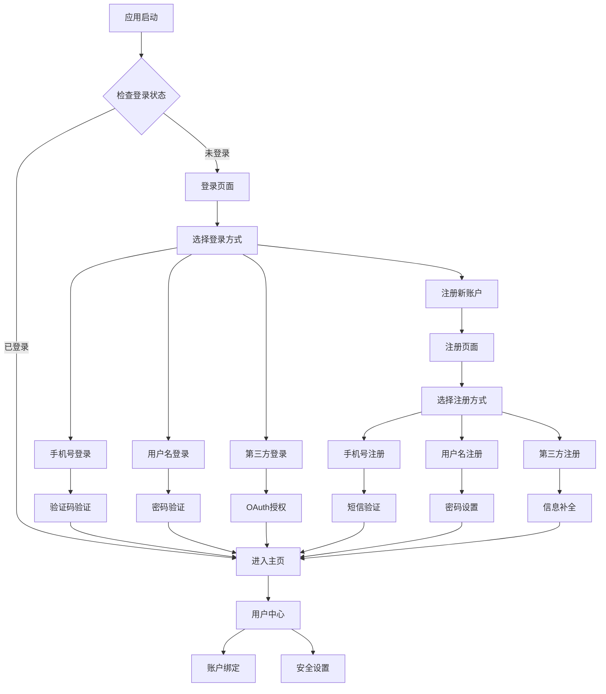

# Supabase多元化认证系统产品需求文档

## 1. 产品概述

本项目旨在为Flutter应用集成Supabase数据库服务，构建一个灵活的多元化用户认证系统，突破传统邮箱注册的单一限制。

- 核心目标：提供手机号、用户名、第三方平台等多种注册登录方式，提升用户体验和注册转化率
- 目标用户：需要快速注册登录的移动应用用户，特别是对邮箱注册有顾虑或不便的用户群体
- 市场价值：通过降低注册门槛和提供多样化登录选择，预期可提升用户注册转化率30%以上

## 2. 核心功能

### 2.1 用户角色

| 角色 | 注册方式 | 核心权限 |
|------|----------|----------|
| 普通用户 | 手机号/用户名/第三方登录 | 基础功能使用、个人信息管理 |
| 认证用户 | 完成身份验证的用户 | 高级功能访问、数据同步 |
| 管理员 | 系统分配 | 用户管理、系统配置、数据统计 |

### 2.2 功能模块

我们的多元化认证系统包含以下主要页面：

1. **登录页面**：多种登录方式选择、快速登录入口
2. **注册页面**：手机号注册、用户名注册、第三方注册
3. **用户中心**：个人信息管理、账户绑定、安全设置
4. **认证管理**：身份验证、账户升级、权限管理
5. **设置页面**：登录偏好设置、隐私设置、账户安全

### 2.3 页面详情

| 页面名称 | 模块名称 | 功能描述 |
|----------|----------|----------|
| 登录页面 | 多方式登录 | 支持手机号+验证码、用户名+密码、第三方OAuth登录（微信、QQ、Apple ID） |
| 登录页面 | 快速登录 | 记住登录状态、生物识别登录、一键登录 |
| 注册页面 | 手机号注册 | 手机号验证、短信验证码、密码设置 |
| 注册页面 | 用户名注册 | 用户名唯一性检查、密码强度验证、可选邮箱绑定 |
| 注册页面 | 第三方注册 | OAuth授权、信息补全、账户关联 |
| 用户中心 | 个人信息 | 头像上传、昵称修改、个人资料编辑 |
| 用户中心 | 账户绑定 | 绑定手机号、邮箱、第三方账户，解绑操作 |
| 认证管理 | 身份验证 | 实名认证、手机验证、邮箱验证状态管理 |
| 认证管理 | 安全中心 | 登录记录、异常登录提醒、设备管理 |
| 设置页面 | 登录设置 | 默认登录方式、自动登录、登录提醒 |
| 设置页面 | 隐私安全 | 密码修改、二次验证、账户注销 |

## 3. 核心流程

### 用户注册流程
用户可选择手机号、用户名或第三方平台进行注册。手机号注册需验证码确认，用户名注册需设置密码，第三方注册需授权并补全必要信息。

### 用户登录流程
支持已注册的任意方式登录，包括密码登录、验证码登录、第三方OAuth登录和生物识别登录。

### 账户管理流程
用户可在个人中心绑定多种登录方式，进行身份认证，管理登录设备和安全设置。

## 4. 用户界面设计

### 4.1 设计风格

- **主色调**：#6366F1（靛蓝色）作为主色，#F8FAFC（浅灰）作为背景色
- **按钮样式**：圆角矩形按钮，8px圆角，渐变色彩，支持按压反馈
- **字体规范**：标题使用18-24px粗体，正文使用14-16px常规字体，提示文字12px
- **布局风格**：卡片式设计，顶部导航，底部标签栏，响应式布局
- **图标风格**：线性图标风格，统一2px线宽，支持主题色彩适配

### 4.2 页面设计概览

| 页面名称 | 模块名称 | UI元素 |
|----------|----------|--------|
| 登录页面 | 登录表单 | 输入框采用圆角边框设计，主按钮使用渐变蓝色(#6366F1到#8B5CF6)，第三方登录按钮采用品牌色彩 |
| 登录页面 | 方式切换 | Tab切换器，下划线指示器，平滑过渡动画 |
| 注册页面 | 注册表单 | 实时验证提示，绿色成功状态，红色错误提示，进度指示器 |
| 用户中心 | 个人信息卡片 | 头像圆形裁剪，信息卡片阴影效果，编辑按钮悬浮设计 |
| 用户中心 | 功能列表 | 列表项左侧图标，右侧箭头指示，分割线设计 |
| 设置页面 | 开关控件 | iOS风格开关，主题色彩，状态动画效果 |

### 4.3 响应性设计

采用移动优先的响应式设计策略，支持手机、平板多尺寸适配，优化触摸交互体验，支持横竖屏切换。